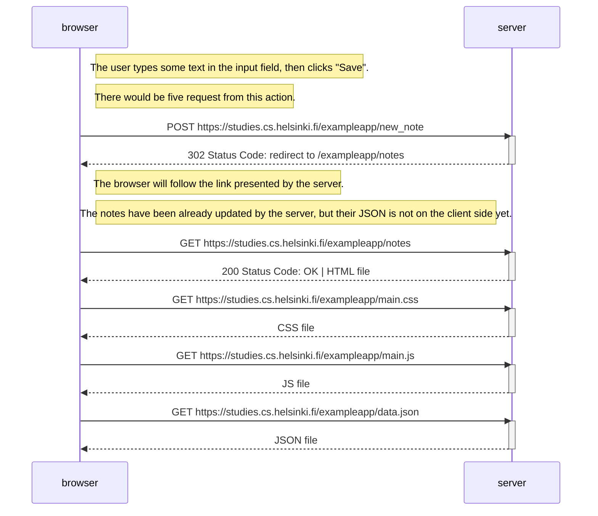

```mermaid
sequenceDiagram
    participant browser
    participant server

    Note right of browser: The user types some text in the input field, then clicks "Save". 
    Note right of browser: There would be five request from this action.
    
    browser->>server: POST https://studies.cs.helsinki.fi/exampleapp/new_note
    activate server
    server-->>browser: 302 Status Code: redirect to /exampleapp/notes
    deactivate server

    Note right of browser: The browser will follow the link presented by the server.
    Note right of browser: The notes have been already updated by the server, but their JSON is not on the client side yet.

    browser->>server: GET https://studies.cs.helsinki.fi/exampleapp/notes
    activate server
    server-->>browser: 200 Status Code: OK | HTML file
    deactivate server

    browser->>server: GET https://studies.cs.helsinki.fi/exampleapp/main.css
    activate server
    server-->>browser: CSS file
    deactivate server

    browser->>server: GET https://studies.cs.helsinki.fi/exampleapp/main.js
    activate server
    server-->>browser: JS file
    deactivate server

    browser->>server: GET https://studies.cs.helsinki.fi/exampleapp/data.json
    activate server
    server-->>browser: JSON file
    deactivate server
```