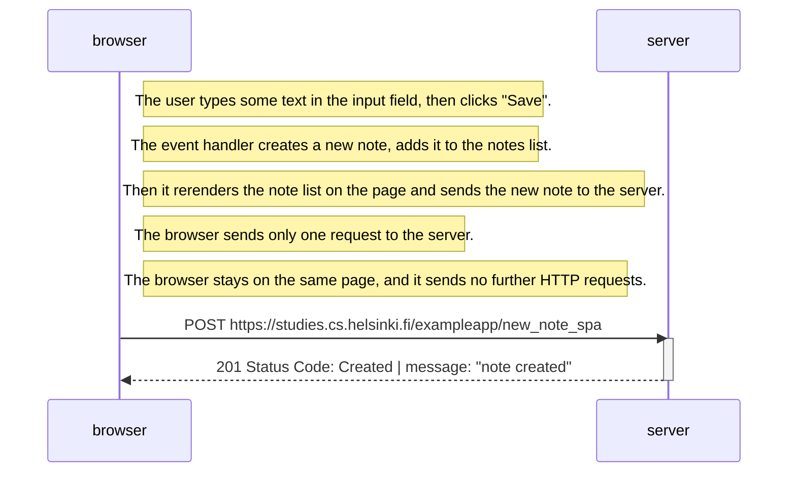

```mermaid
sequenceDiagram
    participant browser
    participant server

    Note right of browser: The user types some text in the input field, then clicks "Save". 
    Note right of browser: The event handler creates a new note, adds it to the notes list.
    Note right of browser: Then it rerenders the note list on the page and sends the new note to the server.
    Note right of browser: The browser sends only one request to the server.
    Note right of browser: The browser stays on the same page, and it sends no further HTTP requests.
    
    browser->>server: POST https://studies.cs.helsinki.fi/exampleapp/new_note_spa
    activate server
    server-->>browser: 201 Status Code: Created | message: "note created"
    deactivate server
```